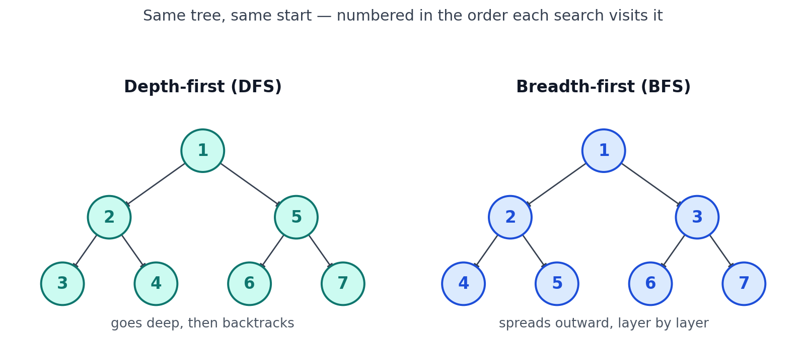
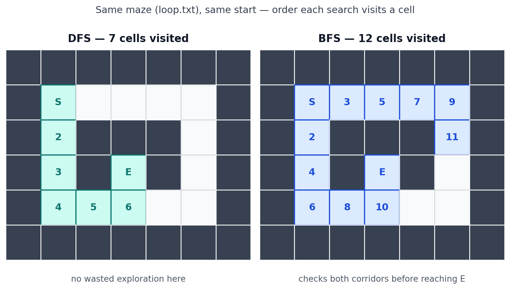

# Maze Solver

A small command-line tool for the JS mastery track: give it a text file with a maze in it, and it either finds a way from `S` to `E` and prints it, or tells you plainly that there isn't one. No loops for the actual pathfinding — just recursion, the way the exercise wants it.

## Files

```
maze.js      parses and validates the maze file
solver.js    the recursive DFS search, plus a BFS version for comparison
index.js     wires maze.js + solve() together and prints the result
compare.js   runs solve() and solveBFS() on the same maze, counts steps in each
test.js      a few sanity checks, run with `node test.js`
maze.txt, no-path.txt, loop.txt, trivial.txt, deadend.txt   sample mazes
```

`solve()` is the one the project is graded on — the recursive backtracking. `solveBFS()` lives in the same file as a second solver for comparison, using a queue instead of the call stack. It's not part of the spec; it's there to answer "how does this compare to the other way of searching a graph."

## The maze format

Plain text, one row per line:

- `#` — wall
- `.` — open floor
- `S` — start (exactly one)
- `E` — end (exactly one)

```
##########
#S...#...#
#.##.#.#.#
#.#..#.#.#
#.#.##.#.#
#....#..E#
##########
```

## Running it

```
node index.js maze.txt
```

If a path exists, it prints the maze back with the path marked in `*` (S and E keep their own letters). If not, it prints exactly `No path exists.` and nothing else.

It also catches and reports, instead of crashing on:

- a missing or unreadable file
- zero or more than one `S`
- zero or more than one `E`
- rows that aren't all the same length
- any character that isn't `#`, `.`, `S`, or `E`

## How the search works

The core idea is recursive backtracking: stand on a cell, and ask "can I reach `E` from here?" That question is answered by asking the exact same question of each of the four neighbors. If a neighbor says yes, you say yes too, and hand back its path with yourself added to the front. If all four say no, you say no as well, and whoever called you tries a different direction.

Every call checks four things, in this order, before doing anything else:

1. Off the grid? → no.
2. It's a wall? → no.
3. Already visited on this attempt? → no. (This is what stops the search from looping forever in a maze with a cycle.)
4. It's `E`? → yes, and the path so far is just this one cell.

If none of those apply, mark the cell visited and try up, down, left, right in turn. The moment one direction comes back with an answer, stop and return it. If none do, this cell was a dead end — return no, and let the caller keep trying.

## DFS vs BFS

The recursion above is depth-first search: it commits to one direction and rides it all the way to a dead end (or the goal) before ever backing up to try another. That's the natural behavior of a recursive call — each call waits on the one after it, so the "memory" of where to try next lives on the call stack, and a stack always hands you back whatever you pushed most recently. Depth-first, last in first out.

Breadth-first search asks the same question but keeps its to-do list in a queue instead of a stack. A queue gives back whatever was added *first*, so instead of chasing one path to its end, BFS tries every neighbor of the start, then every neighbor of those, expanding outward one ring at a time.

Same shape, same starting point, numbered two different ways — left is the order a stack would hand nodes out (dive down one branch fully before the next), right is the order a queue would (finish one level before starting the next):



Here's the same idea on an actual maze — `loop.txt`, which has a loop, so it's a real test of the "already visited" check on both sides. Numbers show the order each search visited a cell (`S` and `E` keep their letters):



DFS visits exactly the 7 cells on its final path and no more, because up/down/left/right happened to line up with the correct route here. BFS visits 12 cells to find a path of the same length, because it has to check both corridors leading away from `S` before it can be sure which one reaches `E` first.

For this project either search would work — the spec only asks for *a* path, not the shortest one — but DFS is the one that falls out naturally from a recursive function, which is why the exercise is built around it. BFS finding the *shortest* path is guaranteed by how it explores (nothing farther away gets checked before everything closer does); that guarantee, and DFS's lack of one, is the actual tradeoff between them. Turning that into an explicit shortest-path guarantee is one of the level-up extensions.

## Counting steps: a pitfall worth knowing about

`compare.js` runs both solvers on the same maze and reports how many cells each one visited. The first version of this counted with a single shared variable bumped at the very top of `solve()`, before any of its checks — so it counted every recursive call, including the ones that immediately bounced off a wall or an out-of-bounds edge. BFS's rejected neighbors never even become a queue item, so they were never in a position to be counted the same way. Comparing the two totals looked like "DFS explores more than BFS," which is backwards — DFS was visiting *fewer* distinct cells, just making more wasted calls to find that out.

The fix was to only increment the DFS counter once a cell has passed all three reject checks — same moment `solveBFS()` counts a cell, right when it comes off the queue. `resetCounts()` also matters here: without it, calling `solve()` and then `solveBFS()` in the same script adds the second count on top of the first instead of starting clean. `test.js` has a check for that specifically, so it can't silently regress.

## Testing it

`node test.js` runs a handful of checks against `maze.js` and `solver.js` directly — parsing a valid maze, rejecting bad ones, finding a path with `solve()` and with `solveBFS()`, returning null when blocked, not getting stuck in a loop, and confirming `resetCounts()` actually resets both counters. No dependencies, just `node:assert`.

`node compare.js maze.txt` prints the path length and step count from both solvers side by side, plus how much longer DFS's path was than BFS's, if at all.

## A note on the sample mazes

Worth double-checking by hand if you're using the tutorial's `maze.txt` and `no-path.txt` as reference output: in `maze.txt`, the wall column running down the middle is solid for the maze's full height, so there's genuinely no path from `S` to `E` — despite the tutorial showing a marked-up "found a path" example for it. And `no-path.txt` has an open gap at the bottom row that actually connects `S` and `E`, contrary to its name. Both were confirmed against an independent search, not just this solver, so it's the example files that are inconsistent, not a bug to chase.
